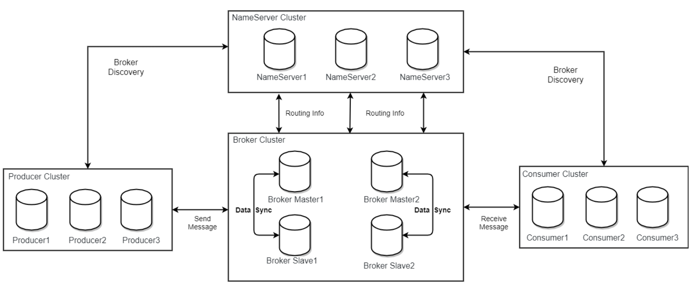

[文档](https://github.com/apache/rocketmq/tree/master/docs/cn)


？

* 架构图
* topic与队列的关(分片？生产者消费者绑定的是Topic，Topic做负载均衡)
* 生产者，消费者为什么分组
* 消息的Topic，Tags，Key(有时候需要获得特定的消息，标签可以用来过滤消息，key为消息的Id?)


一个消费者可以有多个队列


总结：

消息的分类

消息的读取方式

ACK消息应答

集群搭建 

消费者消息重试

事务消息(数据库事务与MQ消息的一致性问题)

补偿机制

如何保证消息不丢失


# 概述


**优点：**

* 单机吞吐量：十万级
* 高可用：分布式架构
* 高可靠：消息可以做到0丢失
* 分布式事务


**MQ常见协议：**


## 基本概念

RocketMQ主要由 Producer、Broker、Consumer 三部分组成，其中Producer 负责生产消息，Consumer 负责消费消息，Broker 负责存储消息。

**Producer**

RocketMQ提供多种发送方式，同步发送、异步发送、顺序发送、单向发送。

**Consumer**

两种消费形式：拉取式消费、推动式消费。应用主动拉取或Broker主动推送，实时性高。

**Broker**

消息中转角色，负责存储消息、转发消息。

**Name Server**

Broker和Topic的映射，类似注册中心和路由


**主题（Topic）**

消息的分类，每个主题包含若干条消息，每条消息只能属于一个主题。

**标签（Tag）**

消息的二级分类

**队列（Queue）**

在Kafka中叫Partition，每个Queue内部是有序的，在RocketMQ中分为读和写两种队列，一般来说读写队列数量一致，如果不一致就会出现很多问题

Message Queue 用于存储消息的物理地址


**Producer Group**

 同一类Producer的集合，这类Producer发送同一类消息且发送逻辑一致。如果发送的是事务消息且原始生产者在发送之后崩溃，则Broker服务器会联系同一生产者组的其他生产者实例以提交或回溯消费。 


**Consumer Group**

 同一类Consumer的集合，这类Consumer通常消费同一类消息且消费逻辑一致。消费者组使得在消息消费方面，实现负载均衡和容错的目标变得非常容易。要注意的是，消费者组的消费者实例必须订阅完全相同的Topic。RocketMQ 支持两种消息模式：集群消费（ ,相同Consumer Group的每个Consumer实例平均分摊消息 ）和广播消费（ 相同Consumer Group的每个Consumer实例都接收全量的消息）。 


**Message**

RocketMQ中每个消息拥有唯一的Message ID，且可以携带具有业务标识的Key。系统提供了通过Message ID和Key查询消息的功能。

**Clustering**

集群消费模式下,相同Consumer Group的每个Consumer实例平均分摊消息。

**Broadcasting**

广播消费模式下，相同Consumer Group的每个Consumer实例都接收全量的消息。

**Normal Ordered Message**

普通顺序消费模式下，消费者通过同一个消息队列（ Topic 分区，称作 Message Queue） 收到的消息是有顺序的，不同消息队列收到的消息则可能是无顺序的。

**Strictly Ordered Message**

严格顺序消息模式下，消费者收到的所有消息均是有顺序的。


## 特性


### 订阅与发布

 消息的发布是指某个生产者向某个topic发送消息；消息的订阅是指某个消费者关注了某个topic中带有某些tag的消息，进而从该topic消费数据。 


### **消息顺序**

表示消费者按照生产者发送的顺序来消费消息。

*全局顺序*：某个Topic下都是顺序消费。适用场景：性能要求不高，所有的消息严格按照 FIFO 原则进行消息发布和消费的场景

*局部顺序*：所有消息根据 sharding key 进行区块分区，同一个分区内的消息按照严格的 FIFO 顺序进行发布和消费。 适用场景：性能要求高，以 sharding key 作为分区字段，在同一个区块中严格的按照 FIFO 原则进行消息发布和消费的场景

如：一个订单产生了三条消息分别是订单创建、订单付款、订单完成。消费时要按照这个顺序消费才能有意义，但是同时订单之间是可以并行消费的，即每个队列中的消息顺序消费。


### **消息过滤**

消费者可以根据Tag进行消息过滤，也可以自定义属性过滤。消息过滤在Broker中进行，优点是减少了网络传输负载，缺点是增加了Broker的负载。

1. 通过Tag

生产者指定消息的Tag，消费者在获取消息时可以指定一个或多个Tag

2. SQL

需要先修改配置文件。生产者在发送消息时可以给消息设置一些属性(key-value键值对)，消费者在获得消息时可以指定过滤条件(判断属性的值)。

 数字比较, >, >=, <, <=, BETWEEN, =
字符比较, =, <>, IN
IS NULL 或者 IS NOT NULL
逻辑运算AND, OR, NOT 


### **消息可靠性**

影响消息可靠性的场景：

1.  硬件资源可立即恢复情况 ，  RocketMQ 能保证消息不丢，或者丢失少量数据（依赖刷盘方式是同步还是异步）。

2. 对于单点故障(机器坏了不能马上恢复)一旦发生，此节点上的消息全部丢失。通过异步复制，RocketMQ可以保证99%的消息不丢失。通过同步双写技术可以完全避免单点，同步双写势必会影响性能，适合对消息可靠性要求极高的场合。


### **至少一次**

消费者消费完成后才会向服务器返回ACK，没有消费的一定不会收到ACK，所以保证了消息至少投递一次。可以让消费之知道消息至少被消费过一次。	


### **回溯消息**

消费完的数据，由于消费者出现问题等，需要将之前的消息重复消费一次，Rocket支持按照时间回溯消费，时间维度精确到毫秒。


### **事务消息**

 RocketMQ事务消息（Transactional Message）是指应用本地事务和发送消息操作可以被定义到全局事务中，要么同时成功，要么同时失败。RocketMQ的事务消息提供类似 X/Open XA 的分布事务功能，通过事务消息能达到分布式事务的最终一致。 

 采用了2PC的思想来实现了提交事务消息，同时增加一个补偿逻辑来处理二阶段超时或者失败的消息 


### **定时消息**

延迟队列，消息到达Broker不会立即被消费，发消息时。设置delayLevel等级即可。

定时消息会暂存在名为SCHEDULE_TOPIC_XXXX的topic中，并根据delayTimeLevel存入特定的queue，queueId = delayTimeLevel – 1，即一个queue只存相同延迟的消息，保证具有相同发送延迟的消息能够顺序消费。等待特定时间投递给真正的Topic。

需要注意的是，定时消息会在第一次写入和调度写入真实topic时都会计数，因此发送数量、tps都会变高。


### **消息重试**

消费者消息消费失败后，消息应该能重新消费

消费者消费失败的原因有几种情况：

* 消息的问题：这种消息重试多少次都会失败，应该跳过该消息去消费别的消息，最好提供一种定时重试的机制，即过10s后再重试。
* 消费者的问题：可能消费者的数据库，依赖的下游应用不可用等，这种情况下其他消息也消费不了，索引应该延迟30s再消费下一条数据，减轻Broker重试消息的压力。

RocketMQ中，每个消费组都有一个重试队列，用于保存暂时无法消费的消息。重试队列设置了多个重试级别，后台定时任务按照对应的时间进行Delay后重新保存至重试队列中。


### **消息重投**

生产者在投递消息时，同步和异步方式均需要Broker返回确认信息，单向发送不需要。所以单向的投递没有任何保障。消息重投保证了消息尽可能不丢失，同时还可能造成消息重复(消息量大、网络抖动等)。

- retryTimesWhenSendFailed:同步发送失败重投次数，默认为2，因此生产者会最多尝试发送retryTimesWhenSendFailed + 1次。不会选择上次失败的broker，尝试向其他broker发送，最大程度保证消息不丢。超过重投次数，抛出异常，由客户端保证消息不丢。当出现RemotingException、MQClientException和部分MQBrokerException时会重投。
- retryTimesWhenSendAsyncFailed:异步发送失败重试次数，异步重试不会选择其他broker，仅在同一个broker上做重试，不保证消息不丢。
- retryAnotherBrokerWhenNotStoreOK:消息刷盘（主或备）超时或slave不可用（返回状态非SEND_OK），是否尝试发送到其他broker，默认false。十分重要消息可以开启。


### **流量控制**

生产者流控：因为broker处理能力达到瓶颈；消费者流控：因为消费能力达到瓶颈。

生产者流控：

- commitLog文件被锁时间超过osPageCacheBusyTimeOutMills时，参数默认为1000ms，返回流控。
- 如果开启transientStorePoolEnable == true，且broker为异步刷盘的主机，且transientStorePool中资源不足，拒绝当前send请求，返回流控。
- broker每隔10ms检查send请求队列头部请求的等待时间，如果超过waitTimeMillsInSendQueue，默认200ms，拒绝当前send请求，返回流控。
- broker通过拒绝send 请求方式实现流量控制。

注意，生产者流控，不会尝试消息重投。

消费者流控：

- 消费者本地缓存消息数超过pullThresholdForQueue时，默认1000。
- 消费者本地缓存消息大小超过pullThresholdSizeForQueue时，默认100MB。
- 消费者本地缓存消息跨度超过consumeConcurrentlyMaxSpan时，默认2000。

消费者流控的结果是降低拉取频率。


### **死信队列**

用来处理无法被消费的消息。当一条消息初次消费失败，消息队列会自动进行消息重试；达到最大重试次数后，若消费依然失败，则表明消费者在正常情况下无法正确地消费该消息，此时，消息队列 不会立刻将消息丢弃，而是将其发送到该消费者对应死信队列。 在RocketMQ中，可以通过使用console控制台对死信队列中的消息进行重发来使得消费者实例再次进行消费。 


**流程**


消息的发布是消费者将消息发送到Topic，消息的订阅是消费者订阅Topic下的Tag。


# 基本架构


## 架构图




**NameServer**

管理Broker，向客户端提供路由查询。

NameServer集群中各个实例之间不进行通信，Broker需要向每个NameServer注册自己。


**工作流程**

1. 启动NameServer，等待Broker、Producer、Consumer连接
2. Broker启动，跟所有的NameServer保持长连接，NameServer集群中有Topic跟Broker的映射关系
3. 创建Topic，指定该Topic要存储到哪些Broker，也可以发送消息时自动创建
4. Producer先跟一个NameServer建立长连接，获取当前发送的Topic存在哪些Broker上，轮询从队列列表中选择一个队列，然后与队列所在的Broker建立长连接从而向Broker发消息。
5. Consumer跟其中一台NameServer建立长连接，获取当前订阅Topic存在哪些Broker上，然后直接跟Broker建立连接通道，开始消费消息。

可以看出，消费者，生产者和Broker都需要和NameServer建立长连接。Broker需要更新路由信息，生产者消费者需要更新路由信息


## 部署架构

 Master与Slave 的对应关系通过指定相同的BrokerName，不同的BrokerId 来定义，BrokerId为0表示Master，非0表示Slave。 


**Broker**

用来存储和转发消息，


**Consumer**

* 支持PUSH和PULL两种消费模式(消费者主动取拉取或Broker去push)
* 集群消费和广播消费。一个队列只会被一个消费者消费


## 消息的分类

* 普通消息
* 顺序消息
* 事务消息(RockerMQ特性)，可以用来实现分布式事务


### 顺修消息

局部顺序 ，因为一个Topic中有多个消息队列，可以选择指定的消息队列


## 事务消息

流程


## 消息的读取模式

推/拉

推：

长连接，Broker每隔一段时间检查一次是否有消费者需要的消息

在RocketMQ中，Consumer端的两种消费模式（Push/Pull）都是基于拉模式来获取消息的，而在Push模式只是对pull模式的一种封装，其本质实现为消息拉取线程在从服务器拉取到一批消息后，然后提交到消息消费线程池后，又“马不停蹄”的继续向服务器再次尝试拉取消息。如果未拉取到消息，则延迟一下又继续拉取。 


**负载均衡**


## 一次通信的完整流程

1. Producer 与 NameServer集群中的其中一个节点（随机选择）建立长连接，定期从 NameServer 获取 Topic 路由信息，并向提供 Topic 服务的 Broker Master 建立长连接，且定时向 Broker 发送心跳。
2. Producer轮训某个Topic下面的所有队列实现发送方的负载均衡。


## 部署


1. 启动NameServer


2. Broker部署

Master与Slave 的对应关系通过指定相同的BrokerName，不同的BrokerId 来定义，BrokerId为0表示Master，非0表示Slave。


# 设计


## 消息存储

与消息存储的相关文件：CommitLog， ConsumeQueue， IndexFile

CommitLog： 消息主体以及元数据的存储主体，存储Producer端写入的消息主体内容,消息内容不是定长的 ；Broker单个实例下所有的队列共用一个日志数据文件（即为CommitLog）来存储。

ConsumeQueue：消息消费队列，引入的目的主要是提高消息消费的性能，由于RocketMQ是基于主题topic的订阅模式，消息消费是针对主题进行的，如果要遍历commitlog文件中根据topic检索消息是非常低效的。 

 IndexFile：提供了一种可以通过key或时间区间来查询消息的方法。 


### 消息刷盘

同步刷盘：只有在消息真正持久化至磁盘后RocketMQ的Broker端才会真正返回给Producer端一个成功的ACK响应。同步刷盘对MQ消息可靠性来说是一种不错的保障，但是性能上会有较大影响，一般适用于金融业务应用该模式较多。 

异步刷盘：能够充分利用OS的PageCache的优势，只要消息写入PageCache即可将成功的ACK返回给Producer端。消息刷盘采用后台异步线程提交的方式进行，降低了读写延迟，提高了MQ的性能和吞吐量。  保存了指定Topic下的队列消息在CommitLog中的起始物理偏移量offset，消息大小size和消息Tag的HashCode值。


## 通信机制


## 消息过滤

Consumer端订阅消息是需要通过ConsumeQueue这个消息消费的逻辑队列拿到一个索引，然后再从CommitLog里面读取真正的消息实体内容。 

RocketMQ分布式消息队列的消息过滤方式有别于其它MQ中间件，是在Consumer端订阅消息时再做消息过滤的。  


## 负载均衡

RocketMQ中的负载均衡都在Client端完成，具体来说的话，主要可以分为Producer端发送消息时候的负载均衡和Consumer端订阅消息的负载均衡。 


## 事务消息


## 消息查询


[参考](https://github.com/apache/rocketmq/blob/master/docs/cn/design.md)


# 使用


**添加依赖**

```xml
<dependency>
    <groupId>org.apache.rocketmq</groupId>
    <artifactId>rocketmq-client</artifactId>
    <version>4.9.1</version>
</dependency>
```


```
Error:java: 读取/Users/chenguanlin/.m2/repository/org/springframework/spring-core/5.3.15/spring-core-5.3.15.jar时出错; error in opening zip file
```


## 生产者发送消息


**同步发送**

Producer向broker发送消息，阻塞当前线程等待broker响应发送结果


**异步发送**

Producer 首先构建一个向 broker 发送消息的任务，把该任务提交给线程池，等执行完该任务时，回调用户自定义的回调函数，执行处理结果。


**Oneway发送**

Oneway 方式只负责发送请求，不等待应答，Producer只负责把请求发出去，而不处理响应结果。


默认使用的是同步发送，这样消息丢失的几率最小


## 消费者消费消息


消费的注解，过滤的标签


## 同步消息


## 异步消息


## 单项消息


Topic与Beoker的关系？

Topic绑定到多个Broker上？

自动创建Topic


Queue与Broker？

一个Broker中可以有多个Queue


消费者从NameServer获得路由，直接像Broker发送消息？


修改Broker中Queue的数量

写队列和读队列的数量可以不一致，借此来解决修改Queue数量时的一些问题


```
nohup sh bin/mqnamesrv & 
tail -f ~/logs/rocketmqlogs/namesrv.log
```


```
nohup sh bin/mqbroker -n localhost:9876 -c conf/broker.conf &
tail -f ~/logs/rocketmqlogs/broker.log
```


```
export NAMESRV_ADDR=localhost:9876
sh bin/tools.sh org.apache.rocketmq.example.quickstart.Producer
sh bin/tools.sh org.apache.rocketmq.example.quickstart.Consumer
```


```
bin/mqshutdown
```


```
<dependency>
     <groupId>javax.xml.bind</groupId>
     <artifactId>jaxb-api</artifactId>
     <version>2.3.0</version>
 </dependency>
 <dependency>
     <groupId>com.sun.xml.bind</groupId>
     <artifactId>jaxb-impl</artifactId>
     <version>2.3.0</version>
 </dependency>
 <dependency>
     <groupId>com.sun.xml.bind</groupId>
     <artifactId>jaxb-core</artifactId>
     <version>2.3.0</version>
 </dependency>
 <dependency>
     <groupId>javax.activation</groupId>
     <artifactId>activation</artifactId>
     <version>1.1.1</version>
 </dependency>
```


# 高可用


